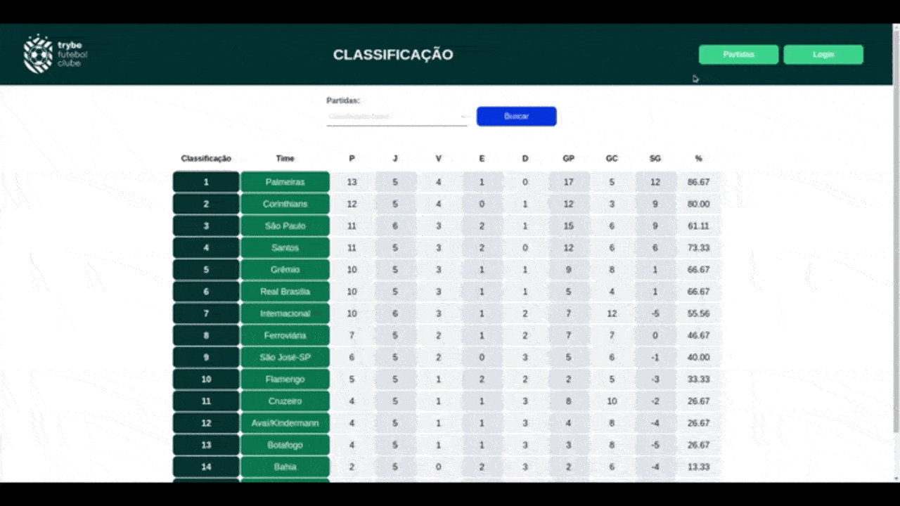

<h1 align="center">
    
     
    Trybe Football Club
</h1>
<h4 align="center">
  Sistema de placar ao vivo para acompanhamento de informações de partidas de futebol.
</h4>

## 🚀 Tecnologias

Esse projeto foi desenvolvido com as seguintes tecnologias:

- NodeJS
- ExpressJS
- TypeScript
- Sequelize-ORM
- JWT
- Bcrypjs
- MySQL
- Docker
- Docker-Compose
- Chai
- Sinon
- Mocha

## 💻 Projeto

Sistema de gerenciamento de partidas de futebol, onde os usuários terão acesso às informações mais importantes das partidas, que estão sendo jogadas e a classificação dos times.

Este projeto foi desenvolvido seguindo o paradigma de **POO**(Programação orientada a objetos) e os princípios do **SOLID** com **TDD**(Desenvolvimento Orientado a Testes).

O projeto foi dividido em **backend** e **frontend**, tudo isso conteinerizado com o **docker**.

No **Backend** temos Typescript, NodeJS, ExpressJS e para fazer o *CRUD* no banco estamos utilizando o Sequelize-ORM, já para autenticação e autorização dos usuários está sendo utilizado o JWT(Json Web Token) e para a criptografia da senha do usuário foi utilizado o Bcryptjs, assim a senha do usuário será salva criptografada no banco de dados.

No **Frontend** temos o React.

#### Comentário
Pretendo no futuro implementar o Swagger-UI para documentar as rotas.

## 🛠️ Como instalar
⚠️ **Atenção**: Você precisa ter o docker e o docker-compose instalados em sua maquina para rodar o projeto.

    # Clonar este repositório
        $ git clone https://github.com/edersonlucas/trybe-football-club
    # Entre no repositório
        $ cd trybe-football-club
    # Instalando as dependencias
        $ npm install
    # Executando o projeto
        $ npm run compose:up
#### 🧪 Rodando os testes de integração do backend
    # Comando
        $ npm run test:coverage
---

Desenvolvido por: [Ederson Lucas](https://www.linkedin.com/in/edersonlucas/)
